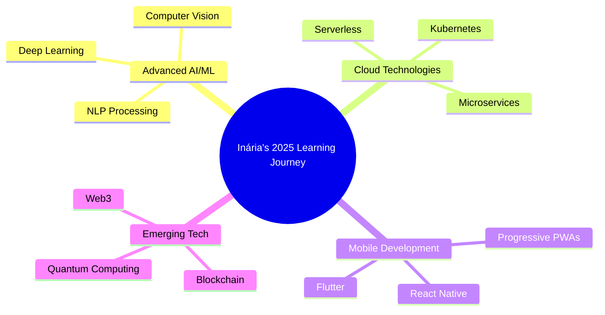

<div align="center">
  
</div>

<div align="center">
  
</div>

<p align="center">
  
  
</p>

---

<table>
<tr>
<td width="50%">

## 👩‍💻 **Sobre Mim**

```python
class Developer:
    def __init__(self):
        self.nome = "Inária Plácido Monjane"
        self.cargo = "Full Stack Developer & Systems Engineer"
        self.localizacao = "Maputo, Moçambique 🇲🇿"
        self.idade = 24  # Born: 14 Jun 2000
        self.email = "inariamanina@gmail.com"
        self.telefone = "+258 840207973"
        
    def especialidades(self):
        return [
            "🐍 Python & Django",
            "⚛️ React.js & Frontend",
            "🗄️ PostgreSQL & Databases", 
            "🤖 Machine Learning & IoT",
            "☁️ Cloud Computing (AWS/Azure)",
            "🏆 Hackathon Champion"
        ]
    
    def filosofia(self):
        return "Criando soluções inovadoras que transformam ideias em impacto real! 🚀"

dev = Developer()
print(f"Disponível para oportunidades: {True}")
```

> *"Comprometida em colaborar com equipes multidisciplinares para entregar resultados que superem as expectativas e impulsionem o crescimento organizacional."*

</td>
<td width="50%">


</td>
</tr>
</table>

---

<h2 align="center">🛠️ Tech Stack & Ferramentas</h2>

<div align="center">

### **👩‍💻 Linguagens de Programação**


### **🌐 Desenvolvimento Web**


### **🧠 Frameworks & Tecnologias**


### **🗄️ Bancos de Dados**


### **☁️ Cloud & DevOps**


</div>

---

<h2 align="center">📊 Estatísticas GitHub</h2>
<div align="center">
  
</div>

---

<h2 align="center">🏆 Conquistas Internacionais</h2>

<div align="center">
<table>
<tr>
<td align="center" width="33%">
🥇<br><strong>WINNER</strong><br>
<sub><strong>TegCampus TEG Planet</strong><br/>
Sistema de Processamento de Imagens<br/>
🗓️ Dec 2022 • 🌍 Malabo, Guiné Equatorial</sub>
</td>
<td align="center" width="33%">
🥇<br><strong>WINNER</strong><br>
<sub><strong>UNESCO India Africa Hackathon</strong><br/>
Monitoramento de Umidade com ML<br/>
🗓️ Nov 2022 • 🇮🇳 Greater Noida, India</sub>
</td>
<td align="center" width="33%">
🏅<br><strong>PARTICIPANT</strong><br>
<sub><strong>Hackathon Internacional Malabo</strong><br/>
Soluções Tecnológicas Assistivas<br/>
🗓️ Dec 2023 • 🌍 Malabo, Guiné Equatorial</sub>
</td>
</tr>
</table>

### **🌟 Destaques dos Projetos Premiados**

</div>

<table>
<tr>
<td width="50%">

### 🗂️ **Sistema de Classificação de Resíduos**
**🏆 WINNER - TegCampus TEG Planet**

**Tecnologias:** `Python` `TensorFlow` `Computer Vision` `Machine Learning`

**Problema resolvido:**
- 🌱 Identificação automática de resíduos recicláveis
- 📸 Processamento de imagens em tempo real  
- ♻️ Promoção de práticas sustentáveis
- 🤖 Algoritmo de classificação inteligente

**Impacto:** Contribuindo para um futuro mais sustentável através da tecnologia! 🌍

</td>
<td width="50%">

### 🌾 **Smart Agriculture with IoT & ML**
**🏆 WINNER - UNESCO India Africa Hackathon**

**Tecnologias:** `IoT` `Machine Learning` `Computer Vision` `Agriculture Tech`

**Funcionalidades:**
- 💧 Monitoramento de umidade do solo
- 📱 Aplicação mobile para agricultores
- 🤖 ML para predição de necessidades hídricas
- 📊 Dashboard com análise de dados

**Impacto:** Revolucionando a agricultura com tecnologia inteligente! 🚜

</td>
</tr>
</table>

---

<h2 align="center">💼 Experiência Profissional</h2>

<div align="center">

### **👩‍🏫 Professora de Programação e Tecnologias Digitais**
**🏢 Algorithmics International School / NEFC Projects Limitada** • *2025 - Presente*

🎯 **Ensino especializado:** Knight (codificação gamificada), programação visual, HTML/CSS, Python
👶 **Público alvo:** Crianças e adolescentes em iniciação à programação
🎮 **Metodologia inovadora:** Gamificação para tornar o aprendizado divertido
📈 **Impacto:** Formando a próxima geração de desenvolvedores

---

### **💻 Programadora Full Stack**
**🏢 Beefactory** • *2025 - Presente*

🐍 **Backend:** Desenvolvimento com Django (Python)
⚛️ **Frontend:** Interfaces modernas com React.js
🔗 **Integração:** APIs externas e serviços terceirizados
🗄️ **Database:** Gestão avançada com PostgreSQL
🔐 **Segurança:** Sistemas de autenticação robustos
📊 **Analytics:** Dashboards administrativos e relatórios automáticos

---

### **📊 Analista e Desenvolvedor de Sistemas (Estágio)**
**🏢 Conselho Municipal de Maputo** • *2024*

📈 **Análise de dados:** Desenvolvimento de sistemas de informação municipais
🛠️ **Suporte técnico:** Resolução de problemas de hardware, software e redes
⚙️ **Infraestrutura:** Instalação e configuração de equipamentos de TI
👥 **Atendimento:** Suporte direto a usuários internos da instituição

</div>

---

<h2 align="center">🎓 Formação & Certificações</h2>

<div align="center">
<table>
<tr>
<th>🎓 Formação Acadêmica</th>
<th>🏅 Certificações & Programas</th>
</tr>
<tr>
<td valign="top">

**🎓 Licenciatura em Engenharia**  
**Tecnologias e Sistemas de Informação**  
*Universidade Joaquim Chissano*  
📍 Maputo, Moçambique  
📅 2018 - 2022

</td>
<td valign="top">

**🚀 Huawei Seeds for the Future Program**  
*HUAWEI* • 2023-2024

**🤖 Machine Learning Lab 1**  
*Conceitos Fundamentais e Práticos* • 2024

**🌐 Conectando Tudo com IoT**  
*TME Education* • 2023

**💼 Ready to Work**  
*Competências Essenciais para o Mercado* • 2024

**🔒 Coding Sprint: Data Security Edition**  
*Treinamento em Segurança de Dados* • 2025

**👩‍💼 Programa Shine**  
*Girls Move Academy* • 2024

**💡 Programa Inovação**  
*Academia Boost x ideialab x Nova SBE* • 2025

</td>
</tr>
</table>
</div>

---

<h2 align="center">🚀 Projetos em Destaque</h2>
<table>
<tr>
<td width="50%">

### 💰 **Sistema de Empréstimos**
**Stack:** Python • Django • PostgreSQL • Bootstrap

**Features:**
- 💼 Sistema completo de gestão de empréstimos
- 👥 Cadastro de clientes e avaliação de crédito
- 📊 Dashboard com relatórios financeiros
- 🔐 Autenticação e autorização robusta
- 📱 Interface responsiva e intuitiva

**Status:** ✅ Concluído  
 📂 **[Código](https://github.com/InariaMonjane/Emprestimo)**
</td>
<td width="50%">

### 🤖 **Sistema de Automação IoT**
**Stack:** Python • TensorFlow • IoT • Machine Learning

**Features:**
- 📡 Sensores IoT integrados
- 🧠 Machine Learning para predições
- 📊 Dashboard de monitoramento
- 📱 App mobile para controle
- ☁️ Deploy em cloud

**Status:** 🔄 Em desenvolvimento  
🔗 **[Demo](https://sistema-de-automa-o-vnaq.bolt.host)** 

</td>
<td width="50%">

### 🤖 **Sistema de Automação IoT**
**Stack:** Python • TensorFlow • IoT • Machine Learning

**Features:**
- 📡 Sensores IoT integrados
- 🧠 Machine Learning para predições
- 📊 Dashboard de monitoramento
- 📱 App mobile para controle
- ☁️ Deploy em cloud

**Status:** 🔄 Em desenvolvimento  
🔗 **[Demo](https://sistema-de-automa-o-vnaq.bolt.host)** 

</td>


</tr>
</table>

---

<h2 align="center">🌱 Atualmente Aprendendo</h2>

<div align="center">



<table>
<tr>
<td align="center" width="25%">

<br><strong>Kubernetes</strong>
<br><sub>Container Orchestration</sub>
</td>
<td align="center" width="25%">

<br><strong>Deep Learning</strong>
<br><sub>Advanced AI Models</sub>
</td>
<td align="center" width="25%">

<br><strong>Flutter</strong>
<br><sub>Cross-platform Mobile</sub>
</td>
<td align="center" width="25%">

<br><strong>Blockchain</strong>
<br><sub>Web3 Development</sub>
</td>
</tr>
</table>

</div>

---

<h2 align="center">🌍 Impacto Global</h2>

<div align="center">
<table>
<tr>
<td align="center" width="25%">
🌍<br><strong>3 Países</strong><br><sub>Hackathons Internacionais</sub>
</td>
<td align="center" width="25%">
🏆<br><strong>2 Vitórias</strong><br><sub>Competições Globais</sub>
</td>
<td align="center" width="25%">
👩‍🎓<br><strong>100+ Alunos</strong><br><sub>Formados em Programação</sub>
</td>
<td align="center" width="25%">
🚀<br><strong>5+ Projetos</strong><br><sub>Soluções Inovadoras</sub>
</td>
</tr>
</table>

### **🎯 Missão Pessoal**
> *"Usar a tecnologia como força transformadora para resolver problemas reais, conectando Moçambique ao mundo da inovação digital."*

**📍 De Maputo para o mundo:** Representando o talento moçambicano em competições internacionais e criando soluções que fazem a diferença localmente e globalmente.

</div>

---

<h2 align="center">📊 Estatísticas de Coding</h2>

<div align="center">

<!--START_SECTION:waka-->
```text
💻 Esta semana eu programei em:

Python       18 hrs 45 mins  ████████████████████░   75.2%
JavaScript    4 hrs 30 mins  ████░░░░░░░░░░░░░░░░░   18.0%
HTML/CSS      1 hr 15 mins   ░░░░░░░░░░░░░░░░░░░░░    5.0%
SQL          30 mins         ░░░░░░░░░░░░░░░░░░░░░    2.0%

🔥 Sequência atual: 73 dias
🏆 Hackathons vencidos: 2
📚 Alunos ensinados: 120+
☕ Café consumido: ∞
```
<!--END_SECTION:waka-->


</div>

---

<h2 align="center">🤝 Referências Profissionais</h2>

<div align="center">
<table>
<tr>
<td align="center" width="50%">

### **👨‍💻 Ivanildo Cau**
**Desenvolvedor**  
*Spoc - KaringanaHub, Carteira Móvel - Tmcel*  

📧 khauivanildo@gmail.com  
📱 (+258) 821426264  

*"Inária demonstra excelente capacidade técnica e liderança em projetos complexos."*

</td>
<td align="center" width="50%">

### **📊 Cardoso Bahule**
**Analista de Dados**  
*Liqui Moly*  

📧 kardosobahuly@gmail.com  
📱 (+258) 848387272  

*"Profissional dedicada com forte expertise em análise de dados e desenvolvimento."*

</td>
</tr>
</table>
</div>

---

<h2 align="center">📬 Vamos nos conectar!</h2>

<div align="center">

**🌟 Sempre aberta para colaborações, oportunidades e projetos que transformam o mundo através da tecnologia!**

<br/>

[](https://linkedin.com/in/inaria-monjane)
[](mailto:inariamanina@gmail.com)
[](https://wa.me/258840207973)
[](https://github.com/inariamonjane)
[](https://inariamonjane.dev)

<br/>

**📍 Localização:** Maputo, Moçambique 🇲🇿 • **📱 Telefone:** +258 840207973  
**💼 Status:** `Disponível para oportunidades` • **⏱️ Resposta:** `< 24h`  
**🌍 Idiomas:** Português (Nativo) • English (Fluente)

<br/>

### 💡 **O que posso oferecer:**
- 🚀 Desenvolvimento Full Stack de alta qualidade
- 🤖 Soluções com IA e Machine Learning  
- 🏆 Experiência internacional comprovada
- 👩‍🏫 Mentoria técnica e educação
- 🌍 Perspectiva global com conhecimento local

</div>

---

<details>
<summary>🎪 <strong>Fun Facts & Curiosidades sobre Moçambique</strong> (clique para expandir)</summary>

<br/>

<div align="center">
<table>
<tr>
<td width="50%">

### 🇲🇿 **Orgulho Moçambicano**
- 🌍 **Representando:** Moçambique em hackathons internacionais
- 🏆 **Primeira:** Moçambicana a vencer UNESCO India Africa Hackathon
- 🎯 **Missão:** Colocar Maputo no mapa da inovação tecnológica
- 💪 **Inspiração:** Mostrar que o talento africano conquista o mundo
- 🌟 **Sonho:** Criar um hub de tecnologia em Moçambique

</td>
<td width="50%">

### 👩‍💻 **Meu Mundo Tech**
- ☕ **Combustível:** Chá (tradição moçambicana!)
- 🎮 **Hobby:** Criar jogos educativos para crianças
- 📚 **Paixão:** Ensinar programação para jovens
- 🌱 **Sustentabilidade:** Projetos eco-friendly com tech
- ✈️ **Aventura:** Hackathons internacionais

</td>
</tr>
</table>

### 🌟 **Filosofia de Vida & Código**

```python
class MoçambicanaDeveloper:
    def __init__(self):
        self.origem = "Maputo, Moçambique 🇲🇿"
        self.sonho = "Transformar África através da tecnologia"
        self.valores = ["Inovação", "Educação", "Inclusão", "Sustentabilidade"]
    
    def impacto_desejado(self):
        return {
            "local": "Formar 1000+ jovens programadores em Moçambique",
            "continental": "Conectar talentos africanos globalmente", 
            "global": "Levar soluções africanas para problemas mundiais"
        }
    
    def next_goals_2025(self):
        return [
            "🚀 Lançar startup de EdTech em Maputo",
            "🌍 Participar de 5+ hackathons internacionais", 
            "👩‍🏫 Treinar 200+ crianças em programação",
            "🤖 Desenvolver IA para agricultura moçambicana",
            "📱 Criar app para turismo em Moçambique"
        ]

# Orgulhosamente moçambicana, globalmente competitiva! 🚀
```

### 🎯 **2025 Goals**
- 🏆 Participar de hackathons na Europa e EUA
- 🚀 Lançar minha própria startup tech
- 👩‍🏫 Formar 500+ jovens em programação
- 🤖 Criar soluções de IA para problemas locais
- 🌍 Ser embaixadora tech de Moçambique

</div>

</details>

---

<div align="center">
  
</div>

<div align="center">
  
  [](https://github.com/inariamonjane)
  [](https://github.com/inariamonjane)
  
  **🇲🇿 De Maputo para o mundo • From Maputo to the World 🌍**  
  **✨ Representando o talento moçambicano na tecnologia global! ✨**
  
</div>
