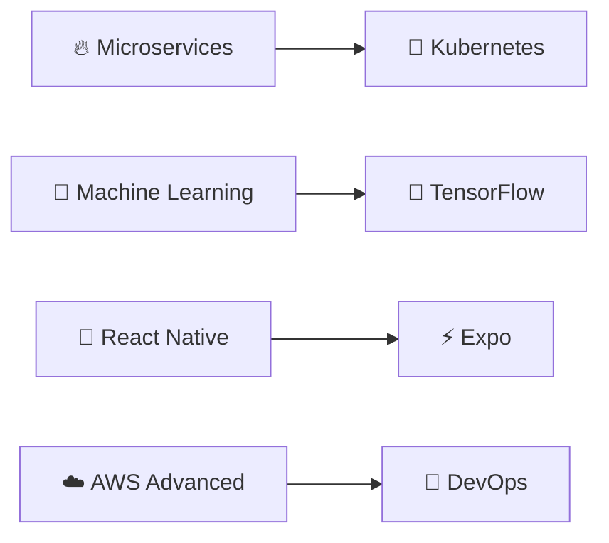

#  Olá! Eu sou **[Seu Nome]**

<div align="center">
  
</div>

<div align="center">
  
  [](https://linkedin.com/in/SEU-LINKEDIN)
  [](https://seu-portfolio.com)
  [](mailto:seu.email@gmail.com)
  [](https://github.com/SEU-USERNAME)
  
</div>

---

## 🚀 **Sobre Mim**

```javascript
const desenvolvedor = {
    nome: "[Seu Nome]",
    cargo: "Full Stack Developer",
    localização: "Brasil 🇧🇷",
    linguagens: ["JavaScript", "Python", "TypeScript"],
    frameworks: ["React", "Node.js", "Django", "Vue.js"],
    databases: ["PostgreSQL", "MongoDB", "MySQL"],
    cloud: ["AWS", "Google Cloud", "Docker"],
    hobbies: ["Coding", "Gaming", "Reading", "Coffee ☕"],
    status: "Disponível para oportunidades",
    foco_atual: "Aprendendo Microservices e DevOps"
};
```

Sou uma desenvolvedora full stack apaixonada por criar soluções que fazem a diferença. Tenho experiência em desenvolvimento web moderno e estou sempre explorando novas tecnologias. Adoro desafios complexos e trabalho em equipe!

---

## ⚡ **Skills & Tecnologias**

<table>
<tr>
  <td valign="top" width="33%">

### 🎨 Frontend


  </td>
  <td valign="top" width="33%">

### ⚙️ Backend


  </td>
  <td valign="top" width="33%">

### 🗄️ Database & Cloud


  </td>
</tr>
</table>

---

## 📊 **Estatísticas GitHub**

<div align="center">
   
  
</div>

<div align="center">
  
</div>

<div align="center">
  
</div>

---

## 🏆 **Projetos em Destaque**

<div align="center">
  
  [](https://github.com/SEU-USERNAME/NOME-DO-REPO-1)
  [](https://github.com/SEU-USERNAME/NOME-DO-REPO-2)
  
</div>

### 🌟 **E-commerce Full Stack**
**Tech Stack:** `React` `Node.js` `PostgreSQL` `Stripe API`
- 🛍️ Plataforma completa com carrinho, pagamentos e painel admin
- 🔐 Autenticação JWT e autorização baseada em roles
- 📱 Design responsivo e otimizado para mobile
- 🚀 **[Demo ao vivo](link-demo)** | 📂 **[Código](link-repo)**

### 🌟 **Sistema de Gerenciamento de Tarefas**
**Tech Stack:** `Vue.js` `Express.js` `MongoDB` `Socket.io`
- ⏰ Colaboração em tempo real entre usuários
- 🎯 Drag & drop para organização de tarefas
- 🔔 Sistema de notificações push
- 🚀 **[Demo ao vivo](link-demo)** | 📂 **[Código](link-repo)**

### 🌟 **API REST para Rede Social**
**Tech Stack:** `Python` `Django REST` `PostgreSQL` `Docker`
- 🔗 API escalável com documentação Swagger
- ⚡ Cache com Redis para alta performance
- 🛡️ Autenticação OAuth2 e rate limiting
- 📖 **[Documentação](link-docs)** | 📂 **[Código](link-repo)**

---

## 🎓 **Formação & Certificações**

| 📚 Formação | 🏛️ Instituição | 📅 Período |
|-------------|----------------|-----------|
| Ciência da Computação | [Nome da Universidade] | 20XX - 20XX |
| Full Stack JavaScript | [Bootcamp/Curso] | 20XX |

| 🏅 Certificação | 🏢 Emissor | 📅 Ano |
|------------------|-----------|-------|
| AWS Certified Developer | Amazon Web Services | 20XX |
| React Developer | Meta/Facebook | 20XX |
| Node.js Certified | OpenJS Foundation | 20XX |

---

## 💼 **Experiência Profissional**

### 💻 **Full Stack Developer** • [Nome da Empresa]
**📅 Jan 2023 - Presente**
- Desenvolvimento de aplicações web usando React, Node.js e PostgreSQL
- Implementação de APIs RESTful e integração com serviços externos
- Colaboração em metodologia ágil (Scrum) em equipe de 5 desenvolvedores
- Aumento de 40% na performance das aplicações através de otimizações

### 🎨 **Frontend Developer** • [Nome da Empresa]
**📅 Mar 2022 - Dez 2022**
- Criação de interfaces responsivas e acessíveis (WCAG 2.1)
- Implementação de testes unitários e de integração (Jest/Cypress)
- Colaboração com designers para implementar protótipos Figma

---

## 🌱 **Aprendendo Atualmente**



- **Microservices Architecture** com Docker e Kubernetes
- **Machine Learning** com Python e TensorFlow
- **Mobile Development** com React Native
- **Advanced AWS** - Lambda, API Gateway, RDS
- **DevOps** - CI/CD, GitHub Actions, Terraform

---

## 🏆 **Conquistas & Reconhecimentos**

🥇 **1º Lugar** - Hackathon Tech Women 2024  
🌟 **Top Contributor** - Projeto Open Source XYZ  
📝 **10+ Artigos** publicados no Medium sobre desenvolvimento  
🎤 **Palestrante** - Conferência JavaScript Brasil 2024  
⭐ **500+ Stars** no GitHub em projetos pessoais  

---

## 📝 **Últimos Posts**

<!-- BLOG-POST-LIST:START -->
- [🔐 Como implementar autenticação JWT segura em Node.js](link)
- [⚡ 10 dicas para otimizar performance em React](link)
- [🚀 Deploy automatizado com GitHub Actions e AWS](link)
- [🐳 Docker para desenvolvedores: guia completo](link)
<!-- BLOG-POST-LIST:END -->

➡️ **[Ver todos os posts](link-do-seu-blog)**

---

## 🎯 **Status dos Projetos**

```
🟢 E-commerce Platform     ████████████████████ 100% Concluído
🟠 Task Manager            ███████████████░░░░░ 75%  Em Desenvolvimento  
🔵 Social Network API      ████████░░░░░░░░░░░░ 40%  Planejamento
🟣 Mobile App              ░░░░░░░░░░░░░░░░░░░░ 0%   Próximo
```

---

## 📈 **Estatísticas de Atividade**

<!--START_SECTION:waka-->
```text
JavaScript   12 hrs 15 mins  ████████████░░░░░   48.2%
Python       8 hrs 30 mins   ████████░░░░░░░░░   33.5%
TypeScript   3 hrs 45 mins   ███░░░░░░░░░░░░░░   14.8%
CSS          55 mins         ░░░░░░░░░░░░░░░░░   3.6%
```
<!--END_SECTION:waka-->

---

## 💬 **Vamos conversar?**

<div align="center">

**🌐 Sempre aberta para novas oportunidades e colaborações!**

[](https://linkedin.com/in/SEU-LINKEDIN)
[](mailto:seu.email@gmail.com)
[](https://wa.me/5511999999999)
[](https://t.me/seu-usuario)

**💼 Status:** `Disponível para oportunidades` • **⏰ Resposta em:** `< 24h`

</div>

---

## 🎪 **Fun Facts**

<details>
<summary>🤔 Clique para descobrir curiosidades sobre mim!</summary>

```yaml
código:
  - Escrevo código desde: "2019"
  - Linguagem favorita: "JavaScript ❤️"
  - Editor preferido: "VS Code com tema Dracula"
  - Sistema operacional: "Ubuntu (Linux)"

lifestyle:
  café: 
    - consumo_diário: "4+ xícaras ☕"
    - tipo_favorito: "Expresso"
  
  música:
    - enquanto_programa: ["Lo-fi", "Jazz", "Synthwave"]
    - para_debuggar: ["Classical", "Ambient"]
  
  hobbies:
    - gaming: "RPGs e Indie Games 🎮"
    - leitura: "Ficção Científica & Tech Books 📚"  
    - plantas: "Tenho 12 plantas no escritório 🌱"
    
  objetivos_2024:
    - "Contribuir para 5 projetos open source"
    - "Dar 3 palestras em eventos tech"
    - "Aprender Rust e Go"
    - "Viajar programando remotamente"
```

**🎯 Meta pessoal:** Impactar positivamente 1000+ pessoas através da tecnologia!

</details>

---

<div align="center">
  
  
  
  
  
  ### 💜 Obrigada pela visita! Let's code together! 💜
  
  **⭐ Se gostou do meu perfil, deixe uma star nos repositórios!**
  
</div>

---

<div align="center">
  
</div>
