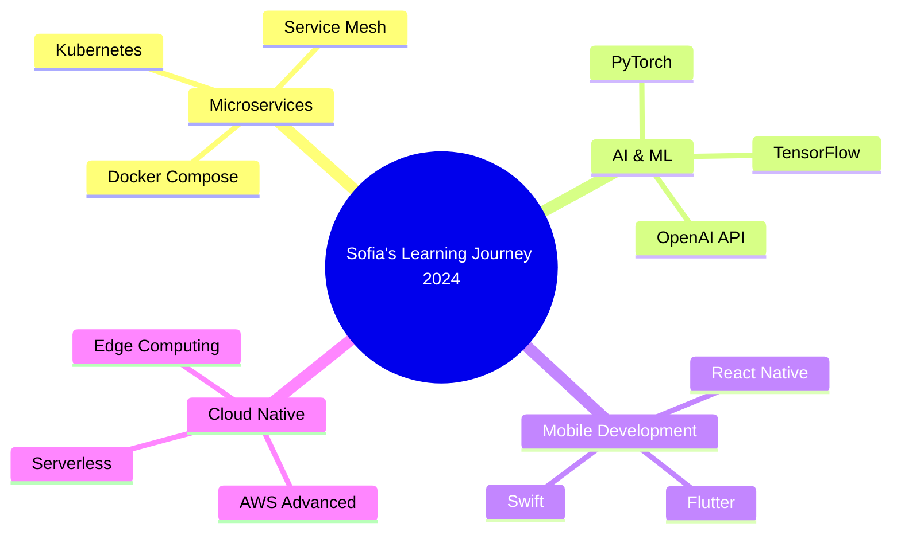

<div align="center">
  
</div>

<div align="center">
  
</div>

---

<table>
<tr>
<td width="50%">

## 👩‍💻 **Sobre Mim**

```typescript
interface Developer {
  nome: string;
  cargo: string;
  localizacao: string;
  idade: number;
  idiomas: string[];
  especializacao: string[];
  hobbies: string[];
  disponibilidade: boolean;
}

const sofia: Developer = {
  nome: "Sofia Santos",
  cargo: "Full Stack Developer",
  localizacao: "São Paulo, Brasil 🇧🇷",
  idade: 26,
  idiomas: ["Português", "Inglês", "Espanhol"],
  especializacao: [
    "React.js", "Node.js", "TypeScript",
    "Python", "PostgreSQL", "AWS"
  ],
  hobbies: ["Coding", "Gaming", "Coffee", "Travel"],
  disponibilidade: true
};
```

> *"Código limpo não é escrito seguindo regras. Código limpo é escrito por programadores que se importam."*

</td>
<td width="50%">


</td>
</tr>
</table>

---

<h2 align="center">🛠️ Tech Stack & Ferramentas</h2>

<div align="center">

### **Frontend Development**


### **Backend Development**


### **Database & Storage**


### **Cloud & DevOps**


</div>

---

<h2 align="center">📊 Estatísticas GitHub</h2>

<div align="center">
  
  
</div>

<div align="center">
  
</div>

---

<h2 align="center">🚀 Projetos em Destaque</h2>

<div align="center">
  <a href="https://github.com/sofiasantos/ecommerce-fullstack">
    
  </a>
  <a href="https://github.com/sofiasantos/task-management-app">
    
  </a>
</div>

<br/>

<table>
<tr>
<td width="50%">

### 🛍️ **E-commerce Platform**
**Stack:** React • Node.js • PostgreSQL • Stripe

**Features:**
- 🔐 Autenticação JWT completa
- 🛒 Carrinho de compras em tempo real
- 💳 Integração com Stripe
- 📊 Dashboard administrativo
- 📱 Design responsivo

**Status:** ✅ Concluído  
🔗 **[Demo](https://ecommerce-demo.vercel.app)** | 📂 **[Código](https://github.com/sofiasantos/ecommerce-fullstack)**

</td>
<td width="50%">

### 📋 **Task Management System**
**Stack:** Vue.js • Express • MongoDB • Socket.io

**Features:**
- ⚡ Colaboração em tempo real
- 🎯 Drag & drop interface
- 🔔 Notificações push
- 📈 Relatórios e analytics
- 👥 Sistema de equipes

**Status:** 🔄 Em desenvolvimento  
🔗 **[Demo](https://taskapp-demo.vercel.app)** | 📂 **[Código](https://github.com/sofiasantos/task-management-app)**

</td>
</tr>
</table>

<table>
<tr>
<td width="50%">

### 🌐 **Social Media API**
**Stack:** Python • Django REST • PostgreSQL • Redis

**Features:**
- 🔗 API RESTful escalável
- 📖 Documentação Swagger
- ⚡ Cache com Redis
- 🛡️ Rate limiting
- 🔒 OAuth2 authentication

**Status:** ✅ Concluído  
📖 **[Docs](https://api-docs.herokuapp.com)** | 📂 **[Código](https://github.com/sofiasantos/social-api)**

</td>
<td width="50%">

### 📱 **React Native App**
**Stack:** React Native • Expo • Firebase • TypeScript

**Features:**
- 📱 Aplicativo multiplataforma
- 🔥 Firebase integration
- 🎨 UI/UX moderno
- 📍 Geolocalização
- 🔔 Push notifications

**Status:** 🚧 Em desenvolvimento  
📱 **[Download](https://expo.dev/@sofia/app)** | 📂 **[Código](https://github.com/sofiasantos/mobile-app)**

</td>
</tr>
</table>

---

<h2 align="center">💼 Experiência Profissional</h2>

<div align="center">

### **🏢 TechCorp Solutions** • *Senior Full Stack Developer*
**📅 Jan 2023 - Presente (1 ano 9 meses)**

- 🚀 Liderou desenvolvimento de 3 aplicações web de grande escala
- 📈 Aumentou performance das aplicações em 65% através de otimizações
- 👥 Mentorou 4 desenvolvedores júnior
- ⚡ Implementou CI/CD reduzindo deploy time em 80%

---

### **🏢 Startup Inovadora** • *Full Stack Developer*
**📅 Mar 2021 - Dez 2022 (1 ano 10 meses)**

- 🔧 Desenvolveu MVP que atraiu 10k+ usuários
- 💻 Stack principal: React, Node.js, PostgreSQL
- 📊 Integrou analytics e métricas de performance
- 🎯 Trabalhou em metodologia ágil com equipe de 8 pessoas

---

### **🏢 Agência Digital** • *Frontend Developer*
**📅 Jun 2020 - Mar 2021 (10 meses)**

- 🎨 Criou 15+ websites responsivos e acessíveis
- 🤝 Colaborou diretamente com designers e clientes
- ⚡ Otimizou sites para SEO e performance
- 📱 Especializou-se em desenvolvimento mobile-first

</div>

---

<h2 align="center">🎓 Formação & Certificações</h2>

<div align="center">
<table>
<tr>
<th>🎓 Formação Acadêmica</th>
<th>🏅 Certificações</th>
</tr>
<tr>
<td>

**🎓 Ciência da Computação**  
*Universidade de São Paulo (USP)*  
📅 2018 - 2022 | GPA: 8.5/10

**📚 Pós-graduação em DevOps**  
*FIAP*  
📅 2023 - 2024

</td>
<td>

**☁️ AWS Certified Solutions Architect**  
*Amazon Web Services* • 2024

**⚛️ React Developer Certification**  
*Meta (Facebook)* • 2023

**🐍 Python Institute PCAP**  
*Python Institute* • 2023

**🏗️ Certified Kubernetes Administrator**  
*CNCF* • 2024

</td>
</tr>
</table>
</div>

---

<h2 align="center">🌱 Atualmente Aprendendo</h2>

<div align="center">



<table>
<tr>
<td align="center" width="25%">

<br><strong>Kubernetes</strong>
<br><sub>Container Orchestration</sub>
</td>
<td align="center" width="25%">

<br><strong>TensorFlow</strong>
<br><sub>Machine Learning</sub>
</td>
<td align="center" width="25%">

<br><strong>Flutter</strong>
<br><sub>Cross-platform Mobile</sub>
</td>
<td align="center" width="25%">

<br><strong>Rust</strong>
<br><sub>Systems Programming</sub>
</td>
</tr>
</table>

</div>

---

<h2 align="center">🏆 Conquistas & Reconhecimentos</h2>

<div align="center">
<table>
<tr>
<td align="center" width="25%">
🥇<br><strong>1º Lugar</strong><br><sub>Hackathon Tech Women 2024</sub>
</td>
<td align="center" width="25%">
⭐<br><strong>1000+ Stars</strong><br><sub>Projetos GitHub</sub>
</td>
<td align="center" width="25%">
🎤<br><strong>5 Palestras</strong><br><sub>Eventos de Tecnologia</sub>
</td>
<td align="center" width="25%">
📝<br><strong>20+ Artigos</strong><br><sub>Medium & Dev.to</sub>
</td>
</tr>
</table>

### **🌟 Destaques 2024**
- 🏆 **"Desenvolvedora do Ano"** - TechCorp Solutions
- 🌍 **Open Source Contributor** - Contribuições para React, Vue.js
- 📚 **Tech Writer** - Artigos com 50k+ visualizações
- 👥 **Community Leader** - Organizadora do meetup "Women in Tech SP"

</div>

---

<h2 align="center">📝 Últimos Posts no Blog</h2>

<div align="center">
<table>
<tr>
<td>

📚 **[Microservices com Node.js: Guia Completo 2024](https://medium.com/@sofia)**  
*Como implementar uma arquitetura de microserviços escalável*  
👀 15.2k visualizações • 💬 89 comentários • ❤️ 234 likes

📚 **[React Server Components: O Futuro do React](https://dev.to/sofia)**  
*Explorando as novas funcionalidades do React 18+*  
👀 8.7k visualizações • 💬 45 comentários • ❤️ 156 likes

📚 **[Deploy Zero-Downtime com Kubernetes](https://hashnode.com/@sofia)**  
*Estratégias para deployments sem interrupção*  
👀 12.1k visualizações • 💬 67 comentários • ❤️ 189 likes

</td>
</tr>
</table>

🔗 **[Ver todos os artigos →](https://linktr.ee/sofiadev)**

</div>

---

<h2 align="center">📊 Estatísticas de Coding</h2>

<div align="center">

<!--START_SECTION:waka-->
```text
💻 Esta semana eu programei em:

JavaScript   15 hrs 30 mins  ████████████████░░░░░   65.2%
TypeScript    4 hrs 45 mins  ████░░░░░░░░░░░░░░░░░   20.0%
Python        2 hrs 15 mins  ██░░░░░░░░░░░░░░░░░░░    9.5%
CSS          1 hr 30 mins   ░░░░░░░░░░░░░░░░░░░░░    6.3%

🔥 Sequência atual: 47 dias
📦 Projetos ativos: 8
☕ Café consumido: ∞
```
<!--END_SECTION:waka-->


</div>

---

<h2 align="center">📬 Vamos nos conectar!</h2>

<div align="center">

**🌟 Sempre aberta para colaborações, oportunidades e bate-papos sobre tech!**

<br/>

[](https://linkedin.com/in/sofia-santos-dev)
[](https://sofiasantos.dev)
[](mailto:sofia.santos.dev@gmail.com)
[](https://medium.com/@sofiasantosdev)
[](https://twitter.com/sofia_dev)
[](https://instagram.com/sofiadev)

<br/>

**💼 Status:** `Disponível para oportunidades` • **⏱️ Tempo de resposta:** `< 12h`  
**📍 Localização:** São Paulo, SP • **🌐 Trabalho remoto:** Sim  

<br/>

### 💡 **O que posso oferecer:**
- 🚀 Desenvolvimento Full Stack de alta qualidade
- 🏗️ Arquitetura de sistemas escaláveis  
- 👥 Mentoria técnica e liderança
- 🎯 Consultoria em tecnologia

</div>

---

<details>
<summary>🎪 <strong>Fun Facts & Curiosidades</strong> (clique para expandir)</summary>

<br/>

<div align="center">
<table>
<tr>
<td width="50%">

### ☕ **Sobre Mim**
- 🎯 **Começei a programar:** Aos 16 anos com HTML/CSS
- 🏆 **Primeiro projeto:** Um blog sobre games em WordPress
- 💡 **Momento "eureka":** Quando criei minha primeira API REST
- 🎮 **Game favorito atual:** Cyberpunk 2077
- 📚 **Livro favorito:** "Clean Code" by Robert Martin
- 🎵 **Playlist de coding:** Lo-fi Hip Hop + Synthwave

</td>
<td width="50%">

### 📊 **Estatísticas Pessoais**
- ☕ **Café por dia:** 4-6 xícaras (sim, muito!)
- 🌱 **Plantas no escritório:** 8 (todas vivas!)
- 🏃‍♀️ **Exercícios:** Yoga 3x/semana
- 🎯 **Meta 2024:** Contribuir para 10 projetos open source
- 📖 **Livros lidos em 2024:** 18 (meta: 24)
- ✈️ **Países visitados programando:** 3

</td>
</tr>
</table>

### 🎨 **Meu Setup de Trabalho**

```yaml
hardware:
  laptop: "MacBook Pro M2 16GB"
  monitor: "Dell UltraSharp 27'' 4K"
  keyboard: "Keychron K8 (mechanical)"
  mouse: "Logitech MX Master 3"
  headphones: "Sony WH-1000XM4"

software:
  os: "macOS Sonoma"
  editor: "VS Code + Vim extensions"
  terminal: "iTerm2 + Oh My Zsh"
  browser: "Chrome + Arc"
  design: "Figma"
  notes: "Notion + Obsidian"

theme_preferences:
  vscode_theme: "Tokyo Night Storm"
  terminal_theme: "Dracula"
  font: "JetBrains Mono"
```

### 🌟 **Filosofia de Código**
> *"Escrevo código como se a pessoa que vai dar manutenção fosse um psicopata violento que sabe onde eu moro"* 😄

**Princípios que sigo:**
- 📝 Código limpo e bem documentado
- 🧪 Testes são obrigatórios, não opcionais
- 🔄 Refatoração constante
- 📚 Aprendizado contínuo
- 👥 Colaboração > competição

</div>

</details>

---

<div align="center">
  
</div>

<div align="center">
  
  [](https://github.com/sofiasantos)
  [](https://github.com/sofiasantos)
  
  **✨ Se gostou do meu perfil, deixe uma estrela nos repositórios! ✨**
  
</div>
